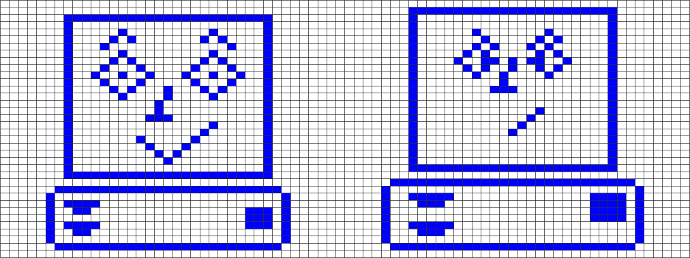

# Exercice 14 (facultatif)

Cet exercice *facultatif* consiste à

- Écrire du code C de manière à reproduire le motif de l’énoncé de l’exercice ;
- Répondre à des questions sur la manière avec laquelle vous avez écrit votre code et ce pour vous amener à réfléchir dessus.

Pour corser la difficulté, votre périeuse (impossible ?) mission pour cet exercice, consiste à ce que :

1. la fonction `computer_ko()` possède impérativement *exactement* le même code que la fonction `computer_ok()` excepté uniquement des changements de nombres (seuls des nombres en paramètres et des nombres dans les `repeat()` peuvent changer) ;
1. *Aucun* `move_to()` n'apparaisse dans la solution (ce qui implique que chaque fonction, autrement dit, chaque élément dessiné, revient toujours bien à sa position initiale avant de se terminer) ;
1. la fonction `main()` suivante soit *obligatoirement* utilisée *telle quelle* : 

## Réaliser le motif ci-dessous

@[Exercice 14]({"stubs": ["main.c"],"command": "sh /project/target/run.sh", "project" : "facultatif1"})
